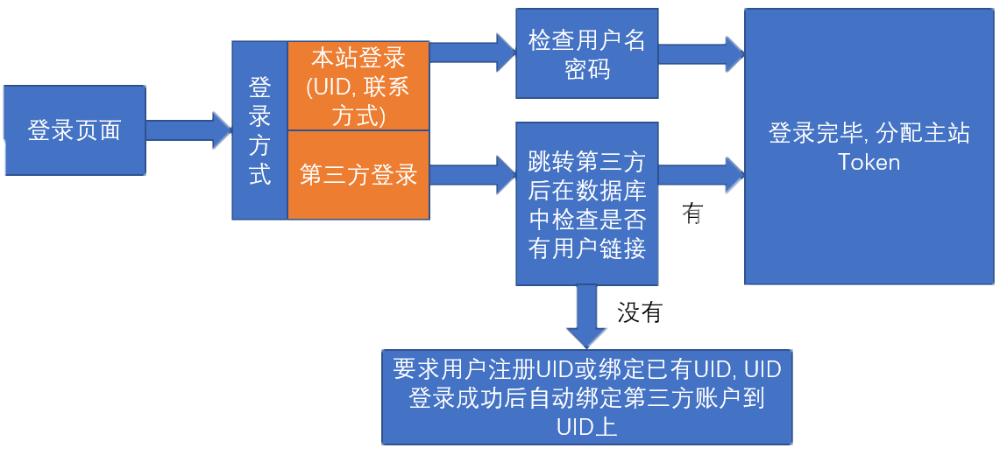

# 项目策划书
最新版本: 20190602-0.0.1   

---

## 项目目的
此项目是为了优化形随意动旗下跨域网站的用户体验, 加快形随意动内部产品开发周期所设立的项目. 

## 项目功能模块

### 用户系统

用户系统可以细分为`第三方APP授权管理服务`, `用户相关服务`.   
`用户相关服务`囊括了所有用户使用该账户所需的服务, 包括登录, 注册, 第三方账户链接, 修改密码, 密码找回, 删除账户.   
`第三方APP授权管理服务`在用户登陆后可让用户控制其他在`InteractivePDK`上注册的`第三方APP`, 且用户使用`InterActiveLiveID`登录的此APP的行为.   

---

`用户ID关键数据点`(统称`UID`): 手机号 / 邮箱 / 人脸特征 待定   
`用户密码类型`(统称`PasswordType`): 文本密码 / SHA密钥串 / 人脸特征

#### 流程图

##### 注册流程

##### 登录流程

