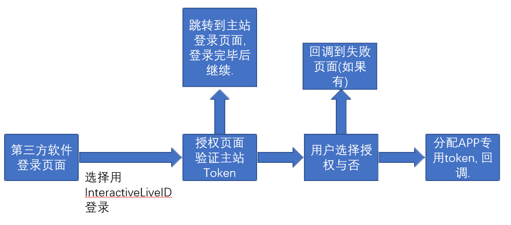

# 项目策划书
最新版本: 20190606-0.1.0   

---

## 1.0 项目目的
此项目是为了优化形随意动旗下跨域网站的用户体验, 加快形随意动内部产品开发周期所设立的项目. 

## 2.0 项目功能模块

### 2.1 用户模块

用户模块可以细分为`第三方APP授权管理服务`, `用户相关服务`.   
`用户相关服务`囊括了所有用户使用该账户所需的服务, 包括登录, 注册, 第三方账户链接, 修改密码, 密码找回, 删除账户.   
`第三方APP授权管理服务`在用户登陆后可让用户控制其他在`InteractivePDK`上注册的`第三方APP`, 且用户使用`InterActiveLiveID`登录的此APP的行为.   

#### 2.1.1 流程图

##### 2.1.1.1 注册流程

##### 2.1.1.2 登录流程

### 2.2 第三方应用OAuth模块

第三方应用OAuth模块是控制第三方APP OAuth授权的一个系统, 负责与第三方APP进行标准OAuth2.0 API的交互.   
第三方应用OAuth模块定义的API需要允许第三方APP执行`用户登录授权`, `用户资源(信息)获取`, `发送提醒信息(邮箱/短信)` 等功能.   
第三方APP管理模块需要与`用户模块`协同配合以读取用户对特定APP的权限设置.   

**注意, 第三方APP所获取的用户Token区别于主站Token**   

#### 2.2.1 流程图

##### 2.2.1.1 第三方授权流程

### 2.3 第三方应用储存模块

第三方应用储存模块是控制第三方APP进行用户数据云端同步的系统, 负责与第三方APP进行拓展数据交互.   
第三方应用储存模块定义的API需要允许第三方APP执行`上传数据`, `下载数据`等功能, 并在云端进行`上传数据格式验证`, `上传数据容量限制`等功能.   
第三方应用储存模块应与第三方应用OAuth模块协同配合以验证客户端提供的OAuth Token是否合法.   

### 2.4 第三方应用管理模块

第三方应用管理模块需要允许用户创建, 修改, 删除第三方APP, 第三方APP的创建者/系统管理员对第三方APP的`管理名单`进行修改, 系统管理员修改`APP所属APP组`, `APP容量限制`, 和`APP组容量限制`.   
第三方应用管理模块定义的API同时需要允许用户`修改上传数据标准格式`, 设置在API处是否`强制需要appsecret`.   

### 2.5 维护模块(综合管理模块)

维护模块是让`InterActivePDK`网站架设主体人员管理本系统的一个模块.   
维护模块需要允许 超级管理员/管理员 修改用户名, 用户组, 用户权限, 用户密码, 用户信息, APP名, APP密码, APP组, APP权限, APP信息. 同时需要允许 超级管理员/管理员 创建/删除 用户/用户组/APPID.   
维护模块需要允许 超级管理员 修改管理员名单.   
维护模块需要允许 超级管理员/管理员 查看/删除/添加 系统日志.   