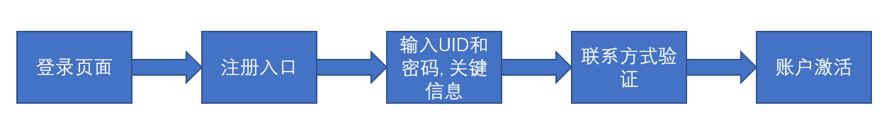

# 项目策划书
最新版本: 20190606-0.1.0   

---

## 项目目的
此项目是为了优化形随意动旗下跨域网站的用户体验, 加快形随意动内部产品开发周期所设立的项目. 

## 项目功能模块

### 用户模块

用户模块可以细分为`第三方APP授权管理服务`, `用户相关服务`.   
`用户相关服务`囊括了所有用户使用该账户所需的服务, 包括登录, 注册, 第三方账户链接, 修改密码, 密码找回, 删除账户.   
`第三方APP授权管理服务`在用户登陆后可让用户控制其他在`InteractivePDK`上注册的`第三方APP`, 且用户使用`InterActiveLiveID`登录的此APP的行为.   

---

`用户ID关键数据点`(统称`UID`): 由系统生成, 此为内部id码, 用户不可见, 每个账户终生不会改变uid   
`用户密码类型`(统称`PasswordType`): 文本密码    

#### 流程图

##### 注册流程

##### 登录流程

##### 第三方授权流程

### 第三方APP管理模块

第三方APP管理模块是控制第三方APP行为的一个系统, 负责与第三方APP进行标准API和拓展API的交互. 第三方APP管理系统定义的API需要允许第三方APP执行`用户登录授权`, `用户资源获取`, `发送提醒信息`等功能.   
第三方APP管理模块需要与`用户模块`协同配合以读取用户对特定APP的权限设置.   
第三方APP管理模块同时需要允许用户创建, 修改, 删除第三方APP, 同时需要允许第三方APP的创建者对第三方APP的管理名单进行修改.   

---

**注意, 第三方APP所获取的用户Token区别于主站Token**   

### 维护模块(综合管理模块)

维护模块是让`InterActivePDK`网站架设主体人员管理本系统的一个模块.   
维护模块需要允许 超级管理员/管理员 修改用户名, 用户组, 用户权限, 用户密码, 用户信息, APP名, APP密码, APP组, APP权限, APP信息. 同时需要允许 超级管理员/管理员 创建/删除 用户/用户组/APPID.   
维护模块需要允许 超级管理员 修改管理员名单.   
维护模块需要允许 超级管理员/管理员 查看/删除/添加 系统日志.   